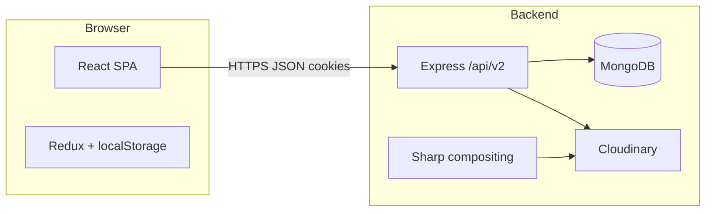

# PODokan

PODokan is a **print-on-demand (POD) marketplace** aimed at **hoodie** products: independent **sellers** run shops, publish designs with placement metadata, and **buyers** browse the catalog, customize options, pay (PayPal / cash-on-delivery in practice), and receive orders. The **backend** stores data in **MongoDB**, uploads media to **Cloudinary**, and can **composite** buyer-specific artwork onto garment templates using **Sharp**. The public HTTP API is versioned under **`/api/v2`**.

This document describes **what the system does**, **how the repositories connect**, **how to run it**, and a **codebase audit** of risks and defects found in the current tree.

---

## Table of contents

1. [Product overview](#product-overview)
2. [User roles](#user-roles)
3. [Repository map](#repository-map)
4. [Architecture](#architecture)
5. [Data & domain model](#data--domain-model)
6. [HTTP API](#http-api)
7. [Authentication & sessions](#authentication--sessions)
8. [Payments & orders](#payments--orders)
9. [Design compositing](#design-compositing)
10. [Realtime (`socket/`)](#realtime-socket)
11. [Configuration & secrets](#configuration--secrets)
12. [Local setup](#local-setup)
13. [Production deployment](#production-deployment)
14. [Scripts reference](#scripts-reference)
15. [Code audit: issues & risks](#code-audit-issues--risks)
16. [License](#license)

---

## Product overview

| Area | Behavior |
|------|----------|
| **Catalog** | Products are shop-scoped; schema enforces hoodie-oriented types/colors and design specs (see `backend/model/product.js`). |
| **Merchandising** | Events and coupon codes exist (`event`, `coupon` routes). |
| **Cart** | Client-side cart in Redux + `localStorage` (`frontend/src/redux/actions/cart.js`). |
| **Checkout** | Shipping captured on the client; backend currently **restricts shipping country to Egypt** in order creation (`backend/controller/order.js`). |
| **Orders** | One API call can create **multiple** `Order` documents when the cart spans multiple shops (grouped by `shopId`). |
| **Admin** | Separate admin flows for users, sellers, products (including pending approval), orders, withdrawals. |
| **Messaging** | Conversation/message controllers exist; **live Socket.IO is not wired** end-to-end (see [Realtime](#realtime-socket)). |

---

## User roles

- **Buyer (`User`)**: Registers, email activation, login, profile, cart, checkout, order history.
- **Seller (`Shop`)**: Separate credentials and JWT/cookie path; dashboard for products, events, coupons, orders, refunds, withdrawals.
- **Admin**: A `User` with `role` treated as admin in middleware (`backend/middleware/auth.js`); elevated routes for moderation and finance.

---

## Repository map

```
podokan/
├── backend/                 # Express API + MongoDB + design utilities
│   ├── server.js            # Loads config/.env, Cloudinary, HTTP server, DB retry
│   ├── app.js               # Middleware, /api/v2 mounts, prod static SPA
│   ├── config/              # Intended location for .env (see server.js)
│   ├── controller/          # Routers: user, shop, product, order, …
│   ├── model/               # Mongoose schemas
│   ├── middleware/          # auth, error handler, rateLimiter (file present)
│   ├── utils/               # JWT, mail, designProcessor, etc.
│   └── ecosystem.config.js  # PM2
├── frontend/                # CRA-style React19 app
│   ├── src/
│   │   ├── App.js           # Routes, axios defaults & interceptors
│   │   ├── server.js        # API base URL constants (not env-driven)
│   │   ├── redux/           # Store, actions, reducers
│   │   ├── components/      # UI by feature
│   │   └── pages/           # Route-level pages
│   └── package.json # Note: npm start uses PM2 (see Scripts)
├── socket/                  # Express stub; Socket.IO commented out
├── package.json             # Root deps only; not a full workspace orchestrator
└── README copy.md           # Leftover Create React App boilerplate (not project docs)
```

---

## Architecture



- **Development**: React dev server (typically port **3000**) calls the API on **`PORT`** (default **8000**). `backend/app.js` allows `http://localhost:3000` when `NODE_ENV` is not `production`.
- **Production**: Set `NODE_ENV=production`. Express serves **`frontend/build`** and falls back to `index.html` for client routes; API routes stay under `/api/v2`.

---

## Data & domain model

Notable Mongoose models (see `backend/model/`):

- **`User`**: credentials, role, avatar; JWT helpers.
- **`Shop`**: seller account, balance, withdrawal metadata.
- **`Product`**: `shopId` / `shop`, design fields, `designSpecs`, reviews, status (`pending` / `public` / `rejected`).
- **`Order`**: embedded `cart` line items (price, design image, specs), shipping snapshot, `user` snapshot, `paymentInfo`, status.
- **`Event`**, **`couponCode`**, **`Conversation`**, **`Message`**, **`Withdraw`**: supporting features (naming includes typo **coupon**).

---

## HTTP API

Routers are mounted in `backend/app.js` as:

`/api/v2/{user,shop,product,event,coupon,payment,order,conversation,message,withdraw}`

Sanity check:

- `GET /api/v2` — API alive.
- `GET /health` — liveness (response shape differs in dev vs prod).

---

## Authentication & sessions

- **Mechanisms**: JWT in **`Authorization: Bearer`** and **`Seller-Authorization: Bearer`**, plus **httpOnly cookies** set on login (`backend/utils/authUtils.js`, `backend/utils/jwtToken.js`).
- **Frontend**: `axios.defaults.withCredentials = true` in `frontend/src/App.js`; tokens are also stored in **`localStorage`** (`token`, `seller_token`), which duplicates cookie state and is **visible to XSS**.
- **Axios interceptor**: Chooses seller vs user token using `config.url.startsWith("/api/v2/...")`. Many calls use **absolute URLs** (`https://…/api/v2/...` from `frontend/src/server.js`), so **`startsWith("/api/v2/")` is false** and seller routes may **not** get `Seller-Authorization` unless each caller sets headers manually (see `redux/actions/product.js`, `redux/actions/sellers.js`).

---

## Payments & orders

- **`backend/controller/payment.js`**: Stripe integration is **fully commented out**; router exports an **empty** payment surface.
- **PayPal (client)**: `frontend/src/components/Payment/Payment.jsx` uses `@paypal/react-paypal-js`. After approval, the client posts to **`/order/create-order`** with `paymentInfo` — there is **no documented server-side PayPal verification** in the audited paths (capture/secret, webhooks).
- **Stripe (client)**: `paymentHandler` still **POSTs** to `${server}/payment/process`, which **does not implement** that route in the backend — the handler body is commented out; failures are likely if that UI path is used.
- **Cash on delivery**: Supported by sending `paymentInfo.type` / `status` from the client; backend defaults exist if `paymentInfo` is missing.
- **Pricing integrity**: `create-order` **trusts** `item.price` from the client cart to compute `subtotal` and `totalPrice` (`backend/controller/order.js`). A malicious client can **underpay** unless prices are re-fetched from `Product` server-side.
- **Shipping cost**: Uses `shippingAddress.shippingPrice` when valid; otherwise defaults to **50** per seller split — also **client-influenced**.

---

## Design compositing

`backend/utils/designProcessor.js` downloads design assets, resolves garment template URLs, and uses **Sharp** to merge layers. Template base URL is **hardcoded** to a specific Cloudinary cloud (`dkot9tyjm`), which couples production assets to one account and complicates forks/staging.

---

## Realtime (`socket/`)

`socket/index.js` starts Express and loads `.env`, but **Socket.IO** setup and all connection handlers are **commented out**. The frontend only has **commented** `socket.io-client` imports in inbox-related files. **Realtime messaging is effectively disabled.**

---

## Configuration & secrets

Backend loads **`backend/config/.env`** from `server.js` (path is relative to the process working directory — usually `backend/`).

| Variable | Used for |
|----------|-----------|
| `DB_URL` | MongoDB (required) |
| `PORT` | Listen port (default `8000`) |
| `NODE_ENV` | CORS, static hosting, cookie `secure` / `sameSite` |
| `JWT_SECRET_KEY`, `JWT_EXPIRES` | Tokens |
| `ACTIVATION_SECRET` | Email activation JWT |
| `COOKIE_EXPIRE_DAYS` | Cookie max-age helper |
| `CLOUDINARY_*` | Uploads |
| `FRONTEND_URL` | Activation links |
| `CORS_ORIGIN` | Production allowlist (comma-separated) |
| `SMTP_*` | Mail |

Frontend: **`frontend/src/server.js`** hardcodes `https://testpodokan.store/api/v2`. Optional CRA vars like `REACT_APP_CLOUDINARY_NAME` appear in isolated utilities.

---

## Local setup

### Backend

```bash
cd backend
npm install
# Create config/.env with at least DB_URL, JWT_SECRET_KEY, ACTIVATION_SECRET, CLOUDINARY_*, SMTP_*, etc.
npm run dev
```

### Frontend

```bash
cd frontend
npm install
# Point frontend/src/server.js at http://localhost:8000/api/v2 for local API
npx react-scripts start
```

Use **`npx react-scripts start`** for normal CRA development. The package **`npm start`** script targets **PM2** and a **`server.js`** that does not exist at the frontend package root (see [Scripts](#scripts-reference)).

### Socket (optional)

```bash
cd socket
npm install
npm start
```

Only useful if you restore Socket.IO; currently it is a stub.

---

## Production deployment

1. `cd frontend && npm run build`
2. Ensure the built assets are available at **`backend/../frontend/build`** relative to `backend/app.js` (repo layout already matches `path.resolve(__dirname, "../frontend/build")`).
3. Run backend with `NODE_ENV=production` and set `CORS_ORIGIN` to your real site(s).
4. **PM2**: `backend/ecosystem.config.js` references `./server.js` and `config/.env`.

---

## Scripts reference

| Location | Script | Note |
|----------|--------|------|
| `backend` | `npm run dev` / `npm start` | `nodemon` vs plain `node` |
| `frontend` | `npm start` | Runs **`pm2 start server.js`** — there is **no** `server.js` in the frontend package root; likely copy-paste from deployment. Use **`react-scripts start`** for dev. |
| `frontend` | `npm run build` | Production bundle; needs `GENERATE_SOURCEMAP=false` already in script |
| `frontend` | `postinstall` | **`patch-package`** — no `patches/` directory was present in the repo at audit time (harmless but pointless until patches exist). |
| `socket` | `npm start` | `node index.js` |

---

## Code audit: issues & risks

This audit is from **static review** of the repository tree. It is **not** a penetration test or formal security assessment. **Every finding lists the file or files involved** so you can open them directly in the editor.

**How to read each entry**

- **Severity** — rough impact class (Critical / High / Medium / Low / Informational).
- **Files** — primary locations (paths are relative to the repository root unless noted).
- **What is wrong** — technical description of the defect or risk.
- **Why it matters** — business, security, or maintenance consequence.
- **Fix direction** — remediation hint (not a full implementation spec).

---

### Critical — security, payments, or financial integrity

#### AUDIT-C01 — Order totals trust client-supplied line-item prices [RESOLVED]

- **Severity:** Critical
- **Files:** `backend/controller/order.js` (throughout the `POST /create-order` handler: validation loop over `cart`, construction of `shopItemsMap`, and computation of `subtotal`, `totalPrice`, and fields passed to `Order.create`). Related client assembly: `frontend/src/components/Payment/Payment.jsx` (`cashOnDeliveryHandler` maps cart items with `price: Number(item.discountPrice ?? item.originalPrice)`), `frontend/src/redux/actions/cart.js` (`price` / `discountPrice` / `originalPrice` on cart items).
- **What is wrong:** The API persists **per-line `price`** and order-level totals derived from the **request body**. It does not re-load `Product` documents from MongoDB to enforce the current listing price, active discount, or seller ownership for each `productId`.
- **Why it matters:** An authenticated user with a valid token can POST a crafted cart with **arbitrary low prices**, creating order records that underpay sellers and the platform. This is independent of whether the PayPal UI was used.
- **Fix direction:** Server-side pricing service: resolve each line by `productId`, check `shopId` and `status`, apply the same rules the storefront uses, and **reject** the request if the client price does not match within a small epsilon.

#### AUDIT-C02 — Per-seller shipping fee is client-influenced

- **Severity:** Critical (when combined with C01)
- **Files:** `backend/controller/order.js` (`shippingCostPerSellerOrder` uses `shippingAddress.shippingPrice` when it is a non-negative number; otherwise defaults to `50`). Client sources: checkout components that build `latestOrder` / `shippingAddress` under `frontend/src/components/Checkout/` and related pages.
- **What is wrong:** Shipping is not purely server-computed from a rate table; the client can supply `shippingPrice` that passes validation.
- **Why it matters:** Attackers reduce or zero out shipping alongside manipulated item prices.
- **Fix direction:** Quote shipping on the server (or validate against a discrete set of allowed values returned from a prior API).

#### AUDIT-C03 — PayPal “success” does not show server-side capture verification

- **Severity:** Critical
- **Files:** `frontend/src/components/Payment/Payment.jsx` (`createOrder`, `onApprove`, `paypalPaymentHandler` — builds `paymentInfo` and POSTs to order API); `backend/controller/order.js` (`POST /create-order` accepts `paymentInfo` from `req.body`). `backend/controller/payment.js` contains only commented Stripe stubs — **no** PayPal verification controller was found in the audit pass.
- **What is wrong:** Trust is placed in the browser-reported payer metadata and client-constructed `paymentInfo`, rather than on **server-side verification** of PayPal captures, webhooks, or idempotent order IDs.
- **Why it matters:** A modified client can **skip PayPal** and still create paid orders. This is fraud and accounting risk.
- **Fix direction:** Implement PayPal server SDK: verify `orderID` / capture, amount, and currency; store PayPal transaction IDs only from verified responses; handle webhooks for disputes.

#### AUDIT-C04 — Stripe `/payment/process` is dead; client still calls it

- **Severity:** Critical (broken revenue path) / High (confusion)
- **Files:** `backend/controller/payment.js` (exported `router` with all routes commented out); `backend/app.js` (mounts `payment` at `/api/v2/payment`); `frontend/src/components/Payment/Payment.jsx` (`paymentHandler` → `axios.post(\`${server}/payment/process\`, paymentData)` while Stripe Elements confirmation is commented).
- **What is wrong:** The backend exposes **no** working `POST /payment/process` handler. The frontend still attempts the request shape for Stripe PaymentIntents.
- **Why it matters:** Card payments cannot complete; error handling may confuse users; security reviewers assume payments exist when they do not.
- **Fix direction:** Implement PaymentIntent creation + webhook, or remove the call and dependencies.

#### AUDIT-C05 — PayPal client ID hardcoded in the SPA bundle //fixed

- **Severity:** Critical (operational / secret hygiene). *Note:* PayPal client IDs are always exposed to browsers; the issue is **source control and environments**, not “hidden secret.”
- **Files:** `frontend/src/components/Payment/Payment.jsx` (`PayPalScriptProvider` `options["client-id"]` literal string).
- **What is wrong:** Environment-specific identifiers are baked into source and git history instead of `REACT_APP_*` or build-time injection.
- **Why it matters:** Harder **rotation**, harder **multi-env** (dev/staging/prod), and audit findings. Old commits retain identifiers.
- **Fix direction:** `process.env.REACT_APP_PAYPAL_CLIENT_ID`; document PayPal dashboard allowed origins per environment.

#### AUDIT-C06 — JWT stored in `localStorage` while httpOnly cookies exist //fixed

- **Severity:** Critical (XSS token theft)
- **Files:** `frontend/src/App.js` (axios interceptor reads `localStorage.getItem("token")` / `seller_token`); `frontend/src/components/Login/Login.jsx` (`localStorage.setItem('token', data.token)`); `frontend/src/redux/actions/user.js` (token persistence); `frontend/src/redux/actions/sellers.js` (reads tokens); `frontend/src/redux/actions/product.js` (`getAuthHeaders` reads both tokens); `backend/utils/jwtToken.js` and `backend/utils/authUtils.js` (set httpOnly cookies and return token in JSON).
- **What is wrong:** **Two parallel** credential channels: cookies (better against XSS) and `localStorage` (readable by any script on the origin).
- **Why it matters:** Any XSS anywhere in the SPA or a malicious extension can **exfiltrate bearer tokens** and impersonate users or sellers.
- **Fix direction:** Cookie-only sessions for browser clients, or strict CSP + nonce scripts and remove `localStorage` tokens.

#### AUDIT-C07 — Helmet Content-Security-Policy disabled //fixed

- **Severity:** Critical (defense in depth)
- **Files:** `backend/app.js` (`helmet({ contentSecurityPolicy: false, crossOriginEmbedderPolicy: false, … })`).
- **What is wrong:** CSP is explicitly off for responses this Express app controls.
- **Why it matters:** Weakens XSS mitigation especially alongside C06.
- **Fix direction:** If the API only returns JSON, document that CSP belongs on the static host/CDN; if any HTML is served, set CSP there.

---

### High — correctness, availability, fragile patterns

#### AUDIT-H01 — `return next()` inside `cart.forEach` callback  // fixed

- **Severity:** High
- **Files:** `backend/controller/order.js` (inside `POST /create-order`, the `cart.forEach` that builds `shopItemsMap`; the branch `if (!designImageObject.url) { return next(new ErrorHandler(...)); }`).
- **What is wrong:** `return next(...)` only returns from the **forEach callback**, not from the Express handler. The loop may continue; `next` may be invoked **more than once** for one HTTP request.
- **Why it matters:** Violates Express “call `next` once” convention; undefined behavior, partial state updates, and difficult production bugs.
- **Fix direction:** Use `for (const item of cart) { ... }` with `return next(err)` on failure, or validate the entire cart in a pure function first.

#### AUDIT-H02 — Duplicate `process` event handlers for crashes

- **Severity:** High
- **Files:** `backend/server.js` (`uncaughtException`, `unhandledRejection`); `backend/app.js` (second pair with `process.exit(1)` messaging).
- **What is wrong:** Importing `app.js` from `server.js` registers **two** listeners per event.
- **Why it matters:** Duplicate shutdowns, noisy logs, harder incident triage.
- **Fix direction:** Single module owns process-level handlers (recommend **`server.js` only**).

#### AUDIT-H03 — In-memory `node-cache` for orders with `useClones: false`

- **Severity:** High (multi-instance / data correctness)
- **Files:** `backend/controller/order.js` (`orderCache` config near file top, `CACHE_KEYS`, `get-user-orders`, `get-order/:id`, seller/admin listings, `clearRelevantOrderCaches`).
- **What is wrong:** Cache is **per process** and not shared across horizontal replicas. `useClones: false` returns **shared references** that callers could mutate.
- **Why it matters:** Stale order lists behind load balancers; subtle response corruption if cached objects are mutated.
- **Fix direction:** Redis with TTL; or `useClones: true`; or remove caching until correctness is proven.

#### AUDIT-H04 — Axios interceptor seller detection incompatible with absolute URLs

- **Severity:** High (auth fragility)
- **Files:** `frontend/src/App.js` (request interceptor: `sellerApiPrefixes` checked via `config.url.startsWith("/api/v2/...")`); `frontend/src/server.js` (exports full HTTPS API base); most Redux/actions use `` `${server}/shop/...` `` absolute URLs.
- **What is wrong:** For typical requests, `config.url` is `https://host/api/v2/...`, which does **not** start with `"/api/v2/"`, so `isSellerRequest` is false unless headers are set manually.
- **Why it matters:** New endpoints may **forget** seller headers → 401s or accidental use of buyer token on seller routes.
- **Fix direction:** Compare URL **pathname**, or use `baseURL` + relative paths everywhere, or centralize `getSellerAxiosConfig()`.

#### AUDIT-H05 — `Payment.jsx`: recursive inner `PaymentInfo` and hook ordering smell  [RESOLVED]

- **Severity:** High (runtime / maintainability)
- **Files:** `frontend/src/components/Payment/Payment.jsx` (inner `const PaymentInfo = …` rendering `<PaymentInfo … />`; `useState` for payment method `select` appears after large handler blocks inside `Payment`).
- **What is wrong:** Self-referential component causes **infinite recursion** if mounted. The outer payment UI may still run, but the file violates common **Rules of Hooks** layout expectations and contains dead hazardous code.
- **Fix direction:** Delete or rename inner component; extract `PaymentOptions`; run `eslint-plugin-react-hooks`.

#### AUDIT-H06 — Shipping country hardcoded to Egypt [FIXED]

- **Severity:** High (business rule / UX)
- **Files:** `backend/controller/order.js` (`shippingAddress.country !== "Egypt"` rejects); compare with `frontend/src/pages/FAQPage.jsx` if marketing implies wider shipping.
- **What is wrong:** Single hardcoded country string.
- **Why it matters:** Legal/marketing mismatch; blocks realistic staging data.
- **Fix direction:** Configurable allowed countries or carrier-driven rules.

#### AUDIT-H07 — Inconsistent Cloudinary require style

- **Severity:** High (upgrade fragility)
- **Files:** `backend/controller/user.js` (`require("cloudinary")` then `.v2.uploader`); `backend/server.js`, `backend/controller/product.js` (pattern with `cloudinary.v2`).
- **What is wrong:** Mixed entrypoints to the same SDK across controllers.
- **Why it matters:** Version bumps can break one file silently.
- **Fix direction:** One import pattern project-wide.

---

### Medium — dependencies, missing middleware, operational risk

#### AUDIT-M01 — Rate limiter not mounted

- **Files:** `backend/middleware/rateLimiter.js`; `backend/app.js` (no `require` / `app.use` of this limiter).
- **What is wrong:** `express-rate-limit` is implemented but never applied to `/api/v2`.
- **Why it matters:** Login, activation, and enumeration endpoints are easier to abuse.
- **Fix direction:** `app.use('/api/v2/', limiter)` with stricter limits on auth routes.

#### AUDIT-M02 — `express-mongo-sanitize` and `xss-clean` not wired

- **Files:** `backend/package.json` (dependencies declared); `backend/app.js` (middleware chain lacks these).
- **What is wrong:** Dependencies present but **no** `app.use` registration.
- **Why it matters:** False sense of security; NoSQL injection and reflected XSS scrubbing are not automatic.
- **Fix direction:** Register per library documentation after body parsers.

#### AUDIT-M03 — Duplicate async route wrappers // fixed by deleting catchAsync.js file

- **Files:** `backend/middleware/catchAsyncErrors.js`; `backend/utils/catchAsync.js`.
- **What is wrong:** Same Promise wrapper duplicated.
- **Fix direction:** One module; grep imports and consolidate.

#### AUDIT-M04 — Suspicious or client-oriented backend dependencies

- **Files:** `backend/package.json` (e.g. `react-redux`, `reselect`, `history`, `js-cookie`, `file-saver`, `https`, `all`, `path-to-regexp`).
- **What is wrong:** Packages that normally belong in a browser bundle appear on the API server.
- **Fix direction:** `depcheck` / `npm prune`; remove unused.

#### AUDIT-M05 — Dual Material UI stacks (v4 + MUI 7)

- **Files:** `frontend/package.json` (`@material-ui/core` and `@mui/material`); consuming components under `frontend/src/components/` (mixed imports likely).
- **What is wrong:** Two design systems, theming models, and CSS solutions in one app.
- **Fix direction:** Complete migration; drop `@material-ui/*`.

#### AUDIT-M06 — Bogus `loadsh` package name

- **Files:** `frontend/package.json`.
- **What is wrong:** `loadsh` is almost certainly a typo or junk dependency; real `lodash` is also listed.
- **Fix direction:** Remove `loadsh`.

#### AUDIT-M07 — Legacy `redux-toolkit` package alongside `@reduxjs/toolkit`

- **Files:** `frontend/package.json`; `frontend/src/redux/store.js` (uses `@reduxjs/toolkit`).
- **What is wrong:** Duplicate / obsolete package name.
- **Fix direction:** Remove `redux-toolkit` if nothing imports it.

#### AUDIT-M08 — Redux store exposes duplicate keys for the same reducer `[FIXED]`

- **Files:** `frontend/src/redux/store.js` (`products` and `product` both set to `productReducer`).
- **What is wrong:** Two state branches mirror the same reducer output.
- **Why it matters:** Components may read stale key after dispatch to the other.
- **Fix direction:** Single key; grep `state.products` vs `state.product`.

#### AUDIT-M09 — Root-level `package.json` clutter

- **Files:** `/home/user/podokan/package.json` (dependencies without workspace scripts).
- **What is wrong:** Unclear install story; duplicates frontend libraries.
- **Fix direction:** Workspaces or delete root deps.

#### AUDIT-M10 — Multer allows 100MB uploads // fixed caped at 10MB

- **Files:** `backend/controller/product.js` (`multer` `limits.fileSize`).
- **What is wrong:** Very large per-file uploads to disk under `uploads/`.
- **Fix direction:** Cap at a realistic image size; stream to Cloudinary if possible.

#### AUDIT-M11 — `express.json` / `urlencoded` limit 50mb // `[FIXED]` lowered to 2MB

- **Files:** `backend/app.js`.
- **What is wrong:** Huge JSON bodies accepted globally.
- **Fix direction:** Lower default; per-route override for rare bulk imports.

#### AUDIT-M12 — CORS allows missing `Origin`

- **Files:** `backend/app.js` (`origin` callback allows `!origin`).
- **What is wrong:** Non-browser clients bypass origin checks; interacts with credentialed cookies.
- **Fix direction:** Document CSRF strategy; tighten if not needed.

#### AUDIT-M13 — Verbose auth success logging

- **Files:** `backend/middleware/auth.js` (`console.log` on successful authentication with path and user id).
- **Fix direction:** Development-only or structured logging with redaction.

#### AUDIT-M14 — Debug `console.log` in user controller

- **Files:** `backend/controller/user.js` (DEBUG log for `sendToken` type near imports).
- **Fix direction:** Remove.

#### AUDIT-M15 — Cookie helper logs in `jwtToken` utility

- **Files:** `backend/utils/jwtToken.js`.
- **Fix direction:** Remove or gate on log level.

#### AUDIT-M16 — Filename typo in design template pattern

- **Files:** `backend/utils/designProcessor.js` (`longseleves-...` segment in `filePattern`).
- **What is wrong:** Likely does not match real Cloudinary asset names.
- **Fix direction:** Align with actual uploads.

#### AUDIT-M17 — Duplicate uploads directory initialization

- **Files:** `backend/controller/product.js` (two IIFEs creating `uploads/`).
- **Fix direction:** Single init.

#### AUDIT-M18 — Stale `README copy.md`

- **Files:** `README copy.md` at repository root.
- **Fix direction:** Delete or redirect to `README.md`.

#### AUDIT-M19 — `socket` process without feature

- **Files:** `socket/index.js`; `socket/package.json`.
- **What is wrong:** Listens on port (default **4000** in code) while Socket.IO is commented out.
- **Fix direction:** Do not deploy until implemented.

#### AUDIT-M20 — `patch-package` postinstall with no patches

- **Files:** `frontend/package.json` (`postinstall`); absence of `frontend/patches/` in repo at audit.
- **Fix direction:** Add patches or drop script.

#### AUDIT-M21 — Frontend `npm start` points at non-existent `server.js`

- **Files:** `frontend/package.json` (`pm2 start server.js`).
- **What is wrong:** No `server.js` at package root (only `src/server.js` constants).
- **Fix direction:** `react-scripts start` as `start`; rename PM2 script.

#### AUDIT-M22 — Hardcoded API host in client `[FIXED]`

- **Files:** `frontend/src/server.js`.
- **What is wrong:** Production URL in source.
- **Fix direction:** `REACT_APP_API_URL`.

#### AUDIT-M23 — Optional Cloudinary env in client util

- **Files:** `frontend/src/utils/designDownload.jsx` (`REACT_APP_CLOUDINARY_NAME`).
- **Fix direction:** Document; validate in dev.

#### AUDIT-M24 — Hardcoded Cloudinary cloud in design processor

- **Files:** `backend/utils/designProcessor.js` (base URL includes cloud name `dkot9tyjm`).
- **What is wrong:** Staging/forks cannot swap accounts without code edits.
- **Fix direction:** `process.env.CLOUDINARY_NAME` or shared config.

#### AUDIT-M25 — Realtime messaging not wired

- **Files:** `socket/index.js` (commented Socket.IO); `frontend/src/pages/UserInbox.jsx`; `frontend/src/components/Shop/DashboardMessages.jsx` (commented `socket.io-client`).
- **What is wrong:** Feature appears intended but inactive.
- **Fix direction:** Implement or remove UI affordances.

#### AUDIT-M26 — Verbose logging in order controller

- **Files:** `backend/controller/order.js` (`console.log` / `console.error` for cache clears, query counts, batch failures).
- **What is wrong:** Operational detail (user ids, counts) in default logs.
- **Fix direction:** Structured logger, levels, PII policy.

---

### Low — naming, UX copy, consistency

#### AUDIT-L01 — Coupon naming typo propagated

- **Files:** `backend/model/couponCode.js`; `backend/controller/couponCode.js`; `backend/app.js` (mounts `./controller/couponCode` as `coupon`); `frontend/src/App.js` (route `/dashboard-coupons`, component `ShopAllcoupons`); `frontend/src/pages/Shop/ShopAllcoupons.jsx`; `frontend/src/components/Shop/Layout/DashboardSideBar.jsx` (nav link).
- **What is wrong:** Persistent **“coupon”** spelling in filenames, models, and URLs.
- **Fix direction:** Alias routes during migration; rename in a breaking API version if needed.

#### AUDIT-L02 — `addTocart` typo in public action name

- **Files:** `frontend/src/redux/actions/cart.js` (`export const addTocart`); importers: `frontend/src/components/cart/Cart.jsx`, `frontend/src/components/Route/ProductDetailsCard/ProductDetailsCard.jsx`, `frontend/src/components/Wishlist/Wishlist.jsx`, `frontend/src/components/Events/EventCard.jsx`, `frontend/src/components/shared/ProductDisplay.jsx`.
- **Fix direction:** Export `addToCart` and alias `addTocart` for compatibility during migration.

#### AUDIT-L03 — PayPal `createOrder` hardcoded description

- **Files:** `frontend/src/components/Payment/Payment.jsx` (`purchase_units` → `description: "Sunflower"`).
- **Fix direction:** Use order title, shop name, or SKU-derived text.

#### AUDIT-L04 — Currency labeling inconsistency (EGP vs USD)

- **Files:** `frontend/src/components/Payment/Payment.jsx` (PayPal `currency_code: "USD"` vs `CartData` labels using `EGP`); `backend/controller/order.js` (Egypt-only shipping; currency not enforced in reviewed excerpt); `backend/model/order.js` (verify fields if currency stored).
- **Fix direction:** Single currency on `Order`; align PayPal and UI.

#### AUDIT-L05 — Misleading file header in auth utilities

- **Files:** `backend/utils/authUtils.js` (opening comment: “Example Structure - Replace with your actual implementation”).
- **Fix direction:** Accurate module description.

#### AUDIT-L06 — `CartData` discount line formatting

- **Files:** `frontend/src/components/Payment/Payment.jsx` (`CartData` — discount row mixes `EGP` with conditional `"E£"`).
- **Fix direction:** One money formatter.

---

### Informational — architectural tradeoffs (not always defects)

#### AUDIT-I01 — Cart is client-authoritative until order POST

- **Files:** `frontend/src/redux/actions/cart.js` (`localStorage.setItem("cartItems", …)`); `backend/controller/order.js` (first full validation at submit).
- **Note:** Common SPA pattern; document support implications (cleared storage = lost cart).

#### AUDIT-I02 — Product model duplicates `shopId` and `shop`

- **Files:** `backend/model/product.js` (both required `ObjectId` refs to `Shop`).
- **Risk:** Fields can **drift** if one update path omits the other.
- **Fix direction:** Single canonical field or `pre('save')` sync.

#### AUDIT-I03 — Default `paymentInfo` when body omits it

- **Files:** `backend/controller/order.js` (`paymentInfo: paymentInfo || { type: "Cash On Delivery", … }`).
- **Note:** Acceptable if every caller is authenticated and COD is intentional; dangerous if any unauthenticated path ever reuses this shape (current route uses `isAuthenticated` in the audited handler).

---

## License

MIT (as stated in `backend/package.json` and `frontend/package.json`).

---

## Contributing / next steps (suggested)

Prioritize **server-side price validation**, **fix `forEach`/`next` in order creation**, **wire or remove payment routes**, **rotate exposed PayPal client id**, **apply rate limiting & sanitization**, and **collapse duplicate auth/logging**. Add a real **`README.md`-only** policy: delete or merge **`README copy.md`**.
